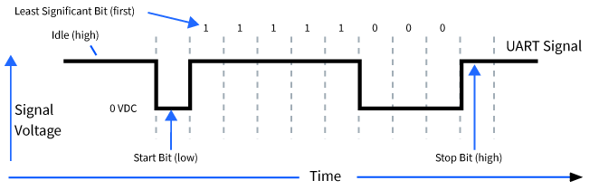

## Introduction

- [ ] TODOs

## Drivers

### UART

#### Basics

- **UART** denotes for **Universal Asynchronous Receiver Transmitter**
- **NOT a protocol** but a **hardware** associated with **serical communication**
  - either an integrated or a dedicated IC
  - by contrast, **SPI** and **I2C** are just communication protocols
- parallel-to-serial data conversion at the transmitter side
- serial-to-parallel data conversion at the receiver side
- configurable parameters like transfer speed and data speed (that's **universal**)
- asynchronous serial communication
  - no clock signal to synchronize or validate the data transmitted from transmitter and received by the receiver
- [ ] synchronous serial communication
- UART uses special bits at the beginning (**start bits**) and ending (**end bits**) of each data word to synchronize the transmitter and receiver
- UART adds *start, parity and stop* bits in order to convert it into a data packet
  - ~~so that means UART drivers?~~
  - these framing bits are automatically **added and managed** by the <u>*UART hardware controller*</u> not the software
  - these framing bits are configurable through **control registers**
- UART packet or **frame**

|    FRame     | Start | data  | parity | stop  |
| :----------: | :---: | :---: | :----: | :---: |
| Length(bits) |   1   | 5 - 9 | 0 - 1  | 1 - 2 |

- **start bit** marks the beginning of the data packet
  - held at a high voltage level, i.e. **1** when there is no data transmitting
  - how it works?
    - transmitter UART pulls the data line from high voltage level to low voltage level
    - receiver UART detects this change from high to low on the data line and then begins reading the actual data
  - [ ] concern: what if the **noise** causes the false positives?
    - threshold detection: validate that the data line stays in the low state for a sufficient period before ackowledging it as a valid start bit
    - software low-pass filter
- **stop bit** marks the end of the transmission
  - maintains the data line at high voltage level, i.e. **1**
- **parity bit**
  - allows the receiver to check whether the received data is correct or not
    - even parity and odd parity
- **data bits**
  - configurable as 5, 6, 7, 8 or 9 bits depending on the implementation
    - 9 bits  are supported by **enhanced UART hardware**
      - what if the hardware doesn't support 9-Bit mode?
        - disable the parity function, and place the 9th bit in the parity bit field
  - LSB first

- **baud rate**

  - the speed at which the data is transmitted
  - baud rate is measured in bits per second

  > With RS-232, the receiver and the transmitter each have their own clock. The clocks should be running at the same frequency, but they are not synchronized to each other. In other words, the phase relationship between the two clocks is entirely random. So, this issue becomes how to accurately transmit and receive the data if each system’s clock is not synchronized with the other? This is the clever solution.
  >
  > First, without getting lost in the arcana of communications protocols, we can simply say that the baud rate (9600 baud, for example) is the bit rate for data transmission. If every data transmission contains 1 start bit, 8 data bits, and 1 stop bit, then transmitting something requires that we send 10 bits of data, or 9600 divided be 10 characters per second. Therefore, 9600 baud would translate to about 960 characters per second. At 9600 bits per second, we need to clock the data in every 104 μs, which requires a clock frequency of 9.6 kHz.
  >
  > Here’s where it gets interesting. We still need to solve the problem of the unsynchronized clocks. This occurs at the receiving end. <u>*The 9.6 kHz data clock is actually divided down by a factor of 16 × from the master clock. When the receiver sees the negative edge of the start bit, it counts 8 cycles of the master clock and then begins to clock in the data every 16 clock cycles of the master clock.*</u>
  >
  > <u>*By counting eight cycles, it starts to clock the data roughly in the middle of each bit being transmitted.*</u> The uncertainty in the phase relationships becomes negligible because the phase difference is in the master clock, not the data clock. As far as the data is concerned, the correct clock edge to bring in the data occurs more or less in the middle of the data bit.

#### Design

##### goals

- [ ] **FSM** based UART driver
- [ ] support both TX and RX
- [ ] support polling and interrupt modes (configurable)

